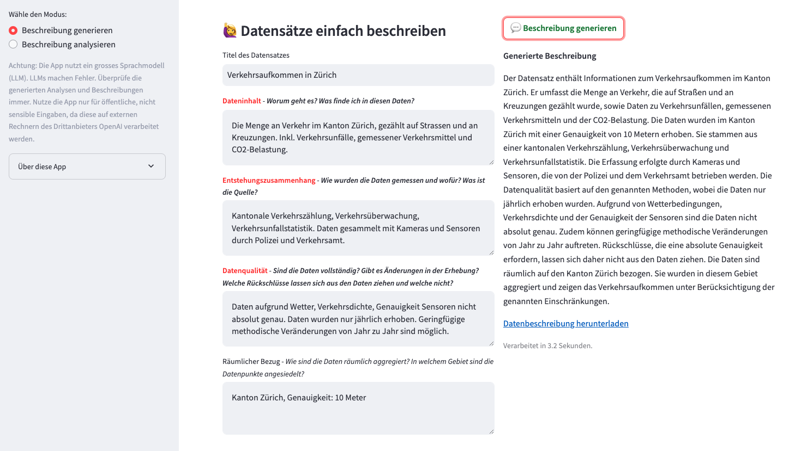

# 🦄 OGD MetaFairy

**Easily create high quality dataset descriptions – with a little help from ✨ AI.**


[](https://github.com/machinelearningZH/ogd_ai-metafairy)
[](https://github.com/machinelearningZH/ogd_ai-metafairy/stargazers)
[](https://github.com/machinelearningZH/ogd_ai-metafairy/issues)
[](https://img.shields.io/github/issues-pr/machinelearningZH/ogd_ai-metafairy)
[](https://github.com/machinelearningZH/ogd_ai-metafairy)
<a href="https://github.com/astral-sh/ruff"></a>

<details>
<summary>Contents</summary>

- [Usage](#usage)
- [What does the app do?](#what-does-the-app-do)
- [What we learned so far](#what-we-learned-so-far)
- [Project team](#project-team)
- [Feedback and contributing](#feedback-and-contributing)
- [Disclaimer](#disclaimer)

</details>



## Usage

```bash
# Clone the repository
git clone https://github.com/statistikZH/ogd_ai-metafairy.git
cd ogd_ai-metafairy

# Install uv and dependencies
pip3 install uv
uv venv
source .venv/bin/activate
uv sync
```

- Create an `.env` file and input your OpenAI API keys like so:

```
    OPENAI_API_KEY=sk-...
```

- Change into the app directory: `cd _streamlit_app/`
- Start the app: `streamlit run metafairy.py`

## What does the app do?

This app simplifies the creation of **meaningful, complete, and well-written dataset descriptions**.

- **Analyze**: Copy an existing description into the input window and click «Beschreibung analysieren».
- **Create**: Enter keywords and basic information about your dataset and click «Beschreibung generieren».

We offer this tool to our data publishers and stewards, and believe it can be helpful for others as well.

The app structures the analysis and the drafts along these four key points:

1. **Data Content** (_Dateninhalt_) - What is the data about? What can be found in this data?
2. **Context of Creation** (_Entstehungszusammenhang_) - How were the data measured and for what purpose? What is the source?
3. **Data Quality** (_Datenqualität_) - Are the data complete? Are there any changes in the collection? What conclusions can and can not be drawn from the data?
4. **Spatial Reference** (_Räumlicher Bezug_) - How are the data spatially collected and aggregated? In which area are the data points located?

> [!Important]
> By using the LLM-based analysis code, **you send data to a third-party provider** via [OpenRouter](https://openrouter.ai), which routes requests to various LLM providers. **Only use non-sensitive data.**

> [!Important]
> **LLMs make errors.** This app **provides suggestions only** and **yields a draft analysis that you should always double-check.**

## What we learned so far

1. Metafairy provides a valuable scaffold for writing good data descriptions. Data stewards use the structure more than the generated text itself.
2. Generating descriptions is fun. 🤓
3. AI improving _existing_ descriptions is more useful than generating new ones. We implemented this feature upon request.

## Project Team

**Laure Stadler**, **Chantal Amrhein**, **Patrick Arnecke** – [Statistisches Amt Zürich: Team Data](https://www.zh.ch/de/direktion-der-justiz-und-des-innern/statistisches-amt/data.html)

Many thanks also go to **Corinna Grobe** and our former colleague **Adrian Rupp**.

## Feedback and contributing

We would love to hear from you. Please share your feedback and let us know how you use the code. You can [write an email](mailto:datashop@statistik.zh.ch) or share your ideas by opening an issue or pull request.

Please note that we use [Ruff](https://docs.astral.sh/ruff/) for linting and code formatting with default settings.

## Disclaimer

This software (the Software) incorporates models (Models) from Google and others and has been developed according to and with the intent to be used under Swiss law. Please be aware that the EU Artificial Intelligence Act (EU AI Act) may, under certain circumstances, be applicable to your use of the Software. You are solely responsible for ensuring that your use of the Software as well as of the underlying Models complies with all applicable local, national and international laws and regulations. By using this Software, you acknowledge and agree (a) that it is your responsibility to assess which laws and regulations, in particular regarding the use of AI technologies, are applicable to your intended use and to comply therewith, and (b) that you will hold us harmless from any action, claims, liability or loss in respect of your use of the Software.
